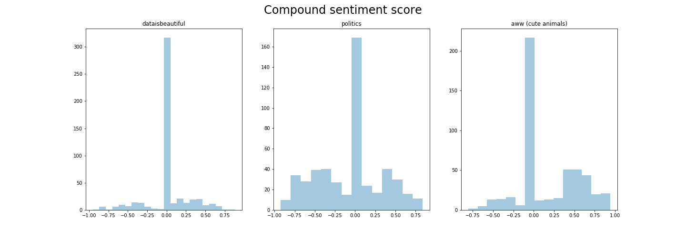
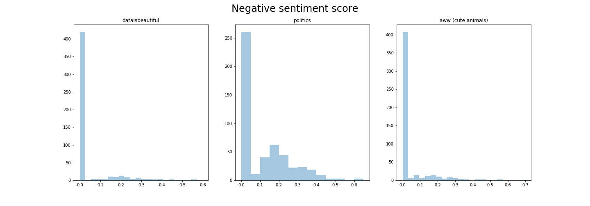
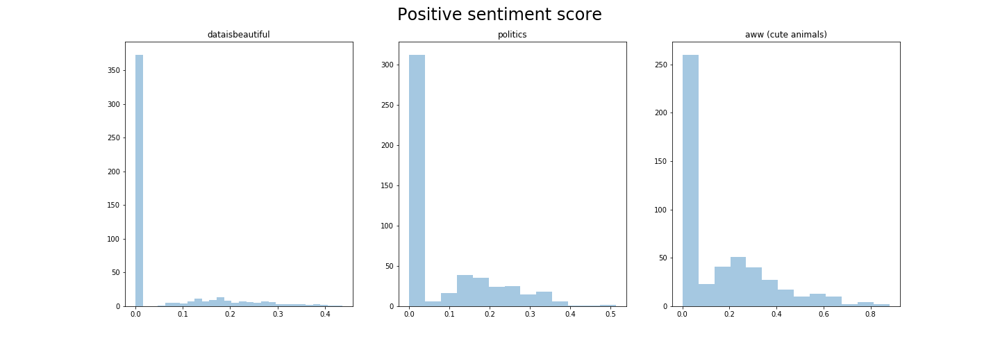
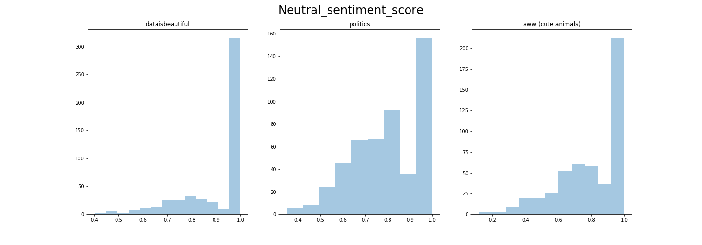
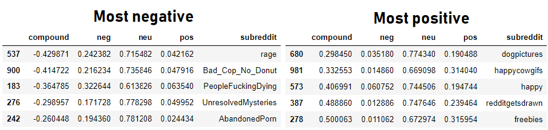
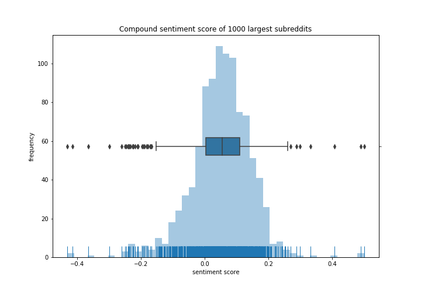

# Sentiment Analysis of Reddit Online Communities with VADER

Goal of the project was to familiarize myself with NLTK:s VADER Sentiment Analysis tool
[[VADER](https://github.com/cjhutto/vaderSentiment)] 
and to explore social media communities based on the sentiment of the material posted in them.
Reddit was chosen as the social media community as its different subreddits 
form a diverse set of communities, which should reflect in the sentiment scores.
Reddit also provides PRAW-api [[PRAW](https://praw.readthedocs.io/en/latest/)]
, which helps in the easy extraction of different posts and comments. Unfortunately
PRAW-api is rate limited, which makes it slow for for extracting large quantities of
data fast. 

For code and extended analysis see the `sentiment_analysis.ipynb` jupyter notebook.

## Prerequisites

`pip install requests bs4 pandas numpy praw nltk seaborn matplotlib`

## Selected results

Compound, Negative, Positive and Neutral VADER sentiment scores for
three selected subreddits

Subreddit sentiment scored ended up following a normal distribution with a large number of outliers with negative sentiment

